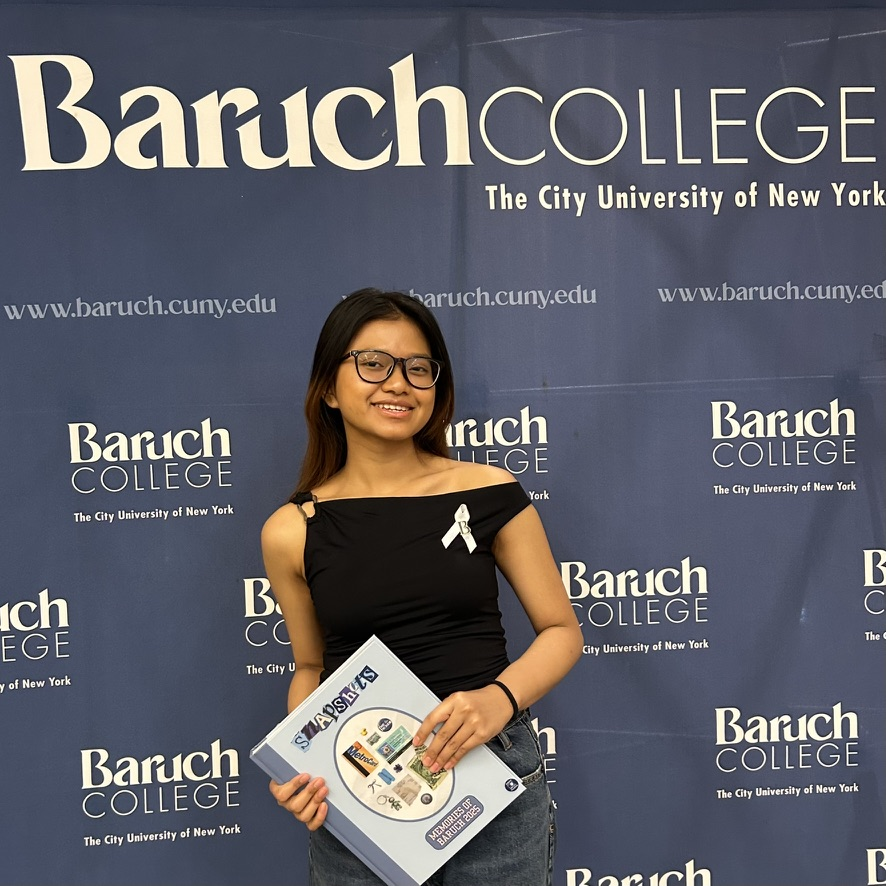

{width=35%}

## Welcome!

Hi! My name is Ennea. I am a graduate student at Baruch College studying AI and Business Analytics with a concentration in Data Analytics.

I am interested in data analysis, business research, and using analytics to support better decision-making.

This website contains my work for STA 9750.

## Mini-Projects

- [Mini-Project 1](mp01.html)
- [Mini-Project 2](mp02.html)
- [Mini-Project 3](mp03.html)
- [Mini-Project 4](mp04.html)

```{r}
#| echo: false
#| message: false
#| warning: false

if(!require("leaflet")){
    options(repos=c(CRAN="https://cloud.r-project.org"))
    install.packages("leaflet")
    stopifnot(require("leaflet"))
}

baruch_longitude <- -73.98333
baruch_latitude  <- +40.74028

leaflet() |>
  addTiles() |>
  setView(baruch_longitude, baruch_latitude, zoom=17) |>
  addPopups(baruch_longitude, baruch_latitude, 
            "I am a Master's student at <b>Baruch College</b>!")
```

```{r}
#| include: false
1+1
```

--------------

Last Updated: `r format(Sys.time(), "%A %m %d, %Y at %H:%M%p")`